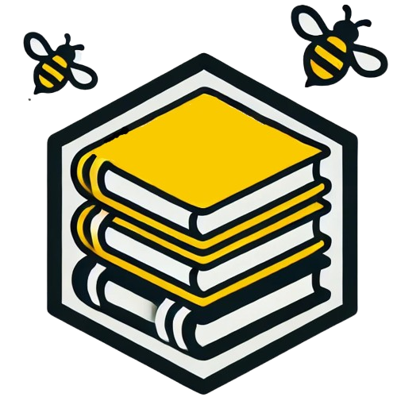

 

    
  </a>

  <h3 align="center">StudyHive</h3>

  

    Oasis Fall 2024 Project
     
     
    <a href="[https://github.com/othneildrew/Best-README-Template/issues/new?labels=bug&template=bug-report---.md](https://studyhive-app.netlify.app/login)">StudyHive Website</a>
  

<!-- ABOUT THE PROJECT -->
## About The Project
StudyHive, an application designed to help students find study partners based on factors like course information, professor details, section data, and class timings. The goal was to create a platform that makes it easier for students to connect with peers in their classes and form effective study groups. Throughout the development process, we focused on building an intuitive user experience, ensuring that students could easily input their course details and get matched efficiently. After refining the platform, we had the opportunity to present StudyHive at Northeastern's CS Demo Day, where we showcased its functionality and impact on student collaboration.

## My Contribution

My contribution to StudyHive focused on wireframing, ideation, and prototyping to shape the application's user experience. I worked on designing an intuitive interface that allowed students to easily input their course details and get matched with study partners. During the ideation phase, I collaborated with the team to refine key features, ensuring the platform effectively addressed student needs. 

I also worked on implementing the front-end in React, bringing the designs to life, and contributed to certain backend functionalities to support seamless data flow.

